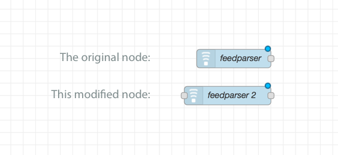

node-red-contrib-feedparser-extended
========================

A modified version of [node-red-node-feedparser2](https://github.com/RayPS/node-red-contrib-feedparser-2) 

Extended the input for injection, not only for timing, but also receiving the url as payload from previous step. 
This is good for debugging the flow or a flexible interval.

Install
-------

Run the following command in your Node-RED user directory - typically `~/.node-red`

        npm install node-red-contrib-feedparser-extended
